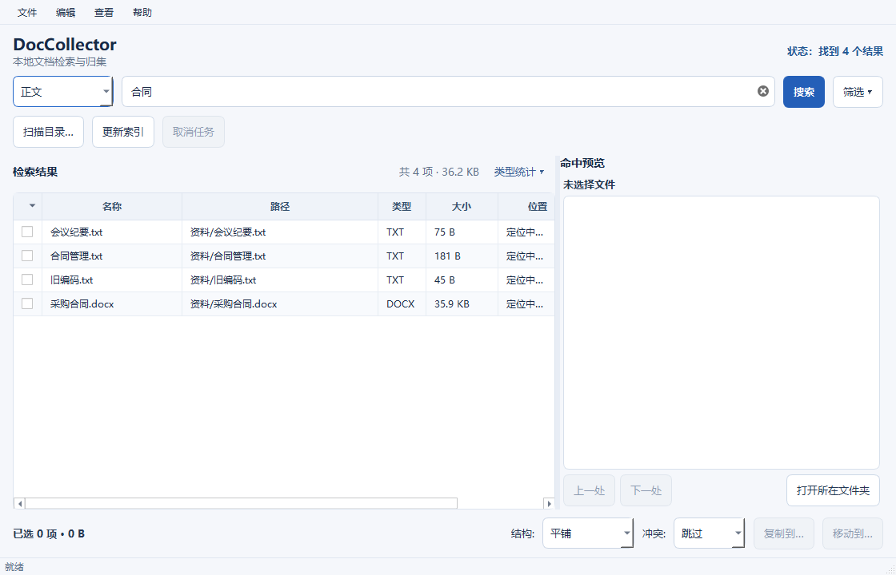
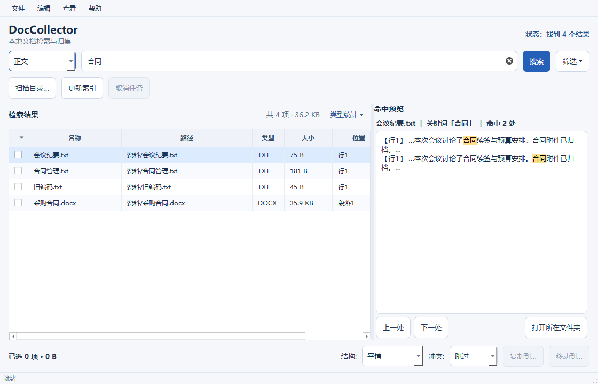
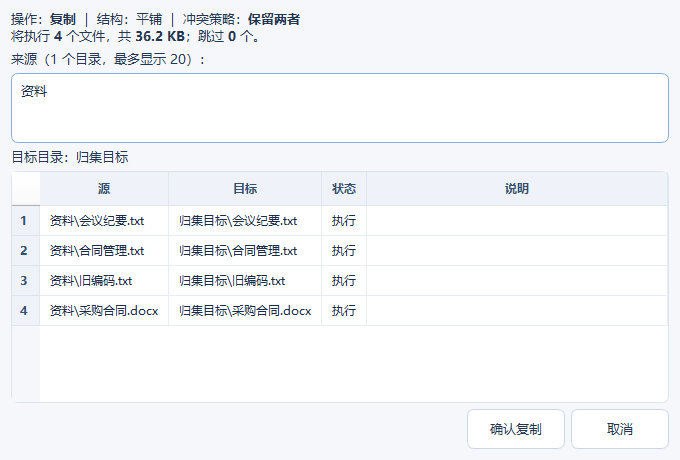

# DocCollector

### Find and collect local documents on Windows

**Search document text and filenames, preview matching passages, then review a copy or move plan before collecting selected files. Indexing and document processing stay on your computer.**

**在 Windows 本机检索文档正文和文件名，查看命中片段，再预览复制或移动计划，将选中的文件集中归档。索引与文档处理均在本机完成。**

[Install and run / 安装与启动](#安装与启动--install-and-run) · [Interface preview / 界面预览](#界面预览--interface-preview)

## 功能 / Features

- 支持 `.txt`、`.md`、`.json`、`.csv`、`.pdf`、`.docx`；PDF 仅提取文字层，不提供 OCR。
  Supports TXT, Markdown, JSON, CSV, text-based PDF, and DOCX. OCR is not included.
- 按字面内容搜索，支持正文、文件名或两者，并提供筛选、命中预览和结果统计。
  Literal search across content, filenames, or both, with filters, hit previews, and result statistics.
- 选中文件后预览复制或移动计划，再处理命名冲突。
  Preview a copy or move plan before collecting selected files and resolving name conflicts.
- 文档处理在本机完成；索引和操作记录默认保存在 `~/.doccollector/`。
  Document processing stays on the local machine. The index and operation log are stored under `~/.doccollector/` by default.

## 界面预览 / Interface preview

主界面展示索引结果与搜索入口。The main window shows indexed results and search controls.



命中预览显示匹配片段，便于确认要归集的文件。Hit previews show matching text before collecting files.



归集计划会在复制或移动前列出目标与命名冲突。The collection plan lists destinations and name conflicts before copying or moving.



更多界面截图 / More screenshots: [展开的筛选条件 / expanded filters](docs/screenshots/02_filters_expanded.png)、[紧凑窗口 / compact window](docs/screenshots/05_compact_window.png)、[紧凑窗口大字体 / compact window with larger text](docs/screenshots/06_compact_large_font.png)。

## 安装与启动 / Install and run

需要 Windows 和 Python 3.10+。在项目目录运行：
Requires Windows and Python 3.10+. Run from the project directory:

```powershell
python -m pip install -r requirements.txt
python main.py
```

安装依赖后，也可以双击 `启动DocCollector.cmd`；它会优先使用项目目录下 `.venv` 中的 Python。
After installing dependencies, you can double-click `启动DocCollector.cmd`. It prefers Python from a local `.venv` when present.

首次使用时，点击“扫描目录…”添加并启用目录，点击“更新索引”，然后输入关键词搜索。搜索结果可勾选并通过“复制到…”或“移动到…”归集。
For first use, add and enable folders with “扫描目录…”, click “更新索引” to build the index, then search. Select results and use “复制到…” or “移动到…” to collect files.

## Windows 打包 / Windows packaging

在可安装依赖的 Windows 环境中运行：
On Windows with access to the required packages, run:

```powershell
powershell -ExecutionPolicy Bypass -File packaging\build_windows.ps1
```

生成的目录为 `dist\DocCollector\`；复制整个目录并运行其中的 `DocCollector.exe`。
The output is `dist\DocCollector\`. Copy the whole directory and run `DocCollector.exe` inside it.

## 许可 / License

[MIT](LICENSE) · Copyright (c) 2026 cloudwallker
